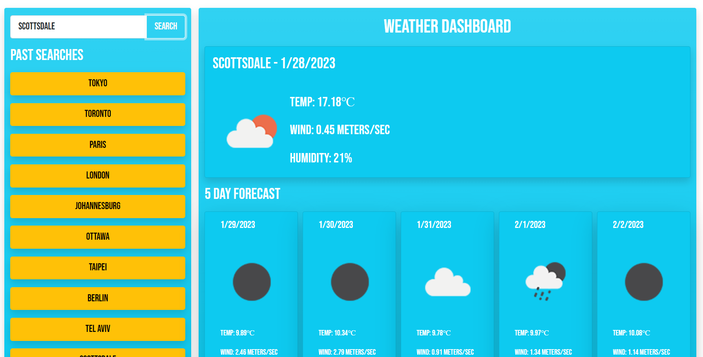
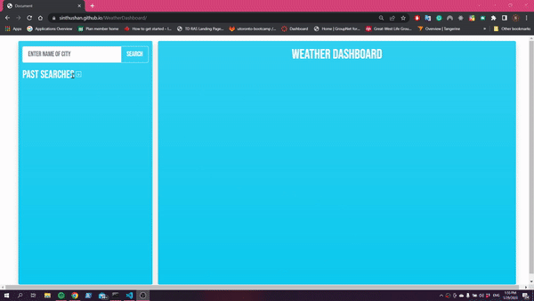

# WeatherDashboard

## Description
The weather dashboard will provide users with the current and 5 day forecast of the city of there choosing. Weather data will include the temperature, wind speed and humidity. Once searched the searched city will persist in the past searches section for quick searches in the future.

## Table of Contents

- [Installation](#installation)
- [Usage](#usage)
- [License](#license)
- [Features](#Features)

## Installation

We are utilizing Bootstrap, Jquery and DayJS by linking to a CDN so no installations are needed. You can learn more by following the links below:
- [Bootstrap](https://getbootstrap.com/docs/3.4/getting-started/)
- [Jquery](https://jquery.com/download/)
- [DayJS](https://day.js.org/docs/en/installation/browser)

## API

All weather data is being provided by the OpenWeatherMap API. We are utilizing the geo location API to convert the city name into a latitude and longitude and the current and 5 day forecast API to get the respective weather data. Documentation for the APIs is available below:

* [OpenWeatherMap - Geolocation API](https://openweathermap.org/api/geocoding-api)
* [OpenWeatherMap - Current Weather API](https://openweathermap.org/current)
* [OpenWeatherMap - Forecast API](https://openweathermap.org/forecast5)

To get an API key, hit subscribe to any of the above mentioned API's here [OpenWeatherMap API](https://openweathermap.org/api) and create an account

## Usage

To view the website you can either go to: [Weather Dashboard](https://sinthushan.github.io/WeatherDashboard/)

or

You can clone the repository using: `git clone git@github.com:sinthushan/WeatherDashboard.git`
Once cloned follow the instructions in the [API Section](#api) to get an API key. Once you have the API key go to the [script.js](/assets/js/script.js) file and replace the value in the APIKEY variable with your API key. Then open up the index.html file in a web browser to see the final product

### steps

* Enter in the city you want to see the weather for then click the search button
* Once you click on search you will see the current and forecasted weather
* All searches will be saved under the past searches list
* By default this list will be collapsed, press the arrow icon to expand
* If user's search does not match any known city, and error will be displayed in the dashboard section

## License

MIT License

